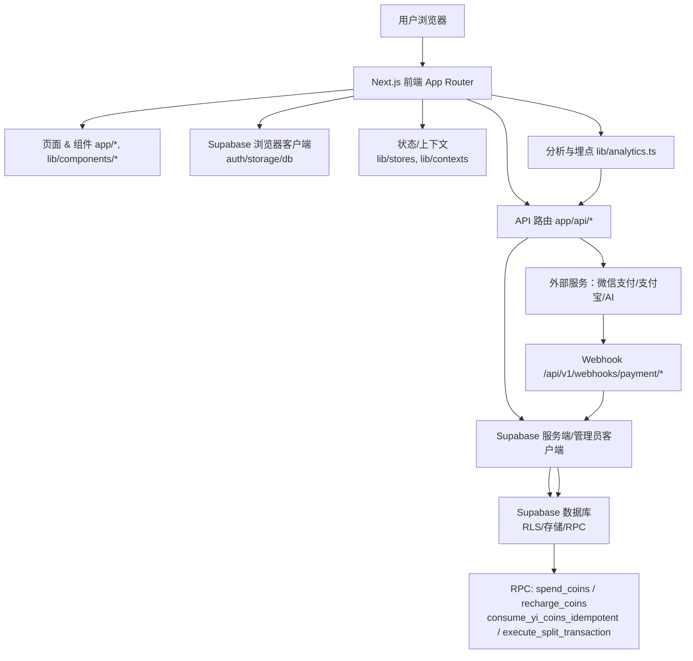
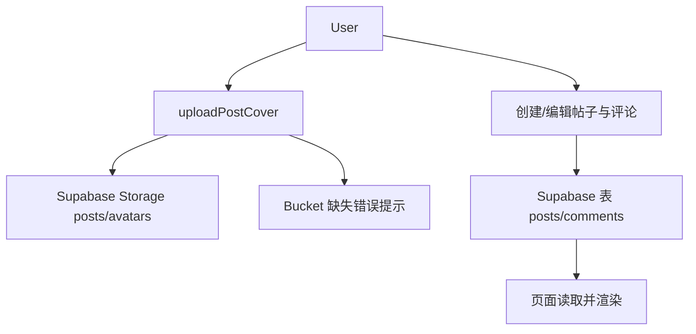

# Web 项目前后端逻辑与技术架构

本文件梳理 yizhi/web 的整体技术架构、前后端交互逻辑、关键模块与数据流。并提供流程图帮助理解模块关系与数据流通。

## 技术栈与结构
- 前端框架：Next.js App Router（[app](file:///Users/huanhuanli/Code/trae_liuyao/yizhi/web/app)、[layout.tsx](file:///Users/huanhuanli/Code/trae_liuyao/yizhi/web/app/layout.tsx)）
- 认证与数据：Supabase（SSR/Browser 客户端，[lib/supabase](file:///Users/huanhuanli/Code/trae_liuyao/yizhi/web/lib/supabase)）
- 后端接口：Next.js API Routes（[app/api](file:///Users/huanhuanli/Code/trae_liuyao/yizhi/web/app/api)）
- 支付：微信支付、支付宝（[wechatpay.ts](file:///Users/huanhuanli/Code/trae_liuyao/yizhi/web/lib/services/wechatpay.ts)、[alipay.ts](file:///Users/huanhuanli/Code/trae_liuyao/yizhi/web/lib/services/alipay.ts)）
- AI 能力：DeepSeek via AI SDK（[ai/analyze](file:///Users/huanhuanli/Code/trae_liuyao/yizhi/web/app/api/ai/analyze/route.ts)）
- 业务服务：统一服务层（[lib/services](file:///Users/huanhuanli/Code/trae_liuyao/yizhi/web/lib/services)）
- 中间件：路由保护与会话刷新（[middleware.ts](file:///Users/huanhuanli/Code/trae_liuyao/yizhi/web/middleware.ts)、[supabase/middleware.ts](file:///Users/huanhuanli/Code/trae_liuyao/yizhi/web/lib/supabase/middleware.ts)）
- UI 与状态：组件库与上下文（[lib/components](file:///Users/huanhuanli/Code/trae_liuyao/yizhi/web/lib/components)、[contexts](file:///Users/huanhuanli/Code/trae_liuyao/yizhi/web/lib/contexts)、[stores](file:///Users/huanhuanli/Code/trae_liuyao/yizhi/web/lib/stores)）

## 总体架构（模块关系与数据流）



关键点：
- 前端优先通过 Supabase 客户端与数据库交互；涉及安全逻辑或第三方服务时通过 API Route 走服务端。
- API Route 根据权限与场景选择 Supabase 服务端客户端（遵循 RLS，或使用 Service Role 进行后台任务）。
- RPC 封装账户扣费、交易拆分等原子逻辑，确保幂等与一致性。

## 认证与路由保护
- 浏览器端获取会话与用户信息：[auth.ts](file:///Users/huanhuanli/Code/trae_liuyao/yizhi/web/lib/services/auth.ts)，使用 [client.ts](file:///Users/huanhuanli/Code/trae_liuyao/yizhi/web/lib/supabase/client.ts)。
- 中间件统一刷新会话与路由保护：[middleware.ts](file:///Users/huanhuanli/Code/trae_liuyao/yizhi/web/middleware.ts)。

```mermaid
graph TD
  Req[请求进入] --> MW[Next.js Middleware 刷新会话]
  MW --> Check{受保护路由? / 公开路由?}
  Check -->|受保护且未登录| Redirect[/login?redirect=当前路径]
  Check -->|公开且已登录| ToHome[重定向到首页或 redirect]
  Check -->|其他| Pass[放行]
```

常用交互：
- 发送验证码/绑定手机号走 API：/api/sms/* /api/user/*（参见 [auth.ts 更新手机号](file:///Users/huanhuanli/Code/trae_liuyao/yizhi/web/lib/services/auth.ts#L100-L141)）。
- 服务端校验与管理员能力：见 [lib/api/supabase-admin.ts](file:///Users/huanhuanli/Code/trae_liuyao/yizhi/web/lib/api/supabase-admin.ts)、[lib/supabase/admin.ts](file:///Users/huanhuanli/Code/trae_liuyao/yizhi/web/lib/supabase/admin.ts)。

## 钱包充值与支付流程
- 前端创建订单：POST /api/v1/wallet/recharge（[route.ts](file:///Users/huanhuanli/Code/trae_liuyao/yizhi/web/app/api/v1/wallet/recharge/route.ts)）
- 后端落库订单：[createRechargeOrder](file:///Users/huanhuanli/Code/trae_liuyao/yizhi/web/lib/services/wallet.ts#L161-L211)
- 第三方下单：微信（[wechatpay.ts](file:///Users/huanhuanli/Code/trae_liuyao/yizhi/web/lib/services/wechatpay.ts)），支付宝（[alipay.ts](file:///Users/huanhuanli/Code/trae_liuyao/yizhi/web/lib/services/alipay.ts)）
- 微信回调入账：/api/v1/webhooks/payment/wechat（[route.ts](file:///Users/huanhuanli/Code/trae_liuyao/yizhi/web/app/api/v1/webhooks/payment/wechat/route.ts)）→ [confirmRecharge RPC](file:///Users/huanhuanli/Code/trae_liuyao/yizhi/web/lib/services/wallet.ts#L234-L245)

```mermaid
graph TD
  U[用户发起充值] --> FE[POST /api/v1/wallet/recharge]
  FE --> ORD[创建 orders 记录]
  ORD -->|ALIPAY| ALI[支付宝下单]
  ORD -->|WECHAT| WX[微信支付下单]
  WX -->|成功| WH[/api/v1/webhooks/payment/wechat]
  WH --> RPC[RPC recharge_coins 入账]
  RPC --> PROF[更新 profiles/coin_transactions]
  WH --> Fallback[兼容旧表结构的回退入账]
  PROF --> UI[前端刷新余额]
```

设计要点：
- 根据 UA/场景选择微信 H5/JSAPI/NATIVE（见 [recharge route](file:///Users/huanhuanli/Code/trae_liuyao/yizhi/web/app/api/v1/wallet/recharge/route.ts#L245-L259)）。
- 微信回调验签、解密、入账，异常时执行回退逻辑保证资金一致性（见 webhook route）。

## AI 分析与扣费流程
- 路由：POST /api/ai/analyze（[route.ts](file:///Users/huanhuanli/Code/trae_liuyao/yizhi/web/app/api/ai/analyze/route.ts)）
- 扣费：RPC consume_yi_coins_idempotent（幂等）
- 失败退款：RPC refund_ai_analysis 或回退加币
- AI 输出流式返回，并在完成时落库结果

```mermaid
graph TD
  U[提交 AI 分析] --> API[/api/ai/analyze]
  API --> Auth[Bearer Token 校验]
  API --> Pay[RPC consume_yi_coins_idempotent 扣费]
  Pay --> Idem{重复请求?}
  Idem -->|是| ReturnCache[返回已有结果/提示处理中]
  Idem -->|否| Call[调用 DeepSeek streamText]
  Call --> Save[保存 ai_analysis_requests 结果]
  Call -->|异常| Refund[RPC refund_ai_analysis 或回退加币]
  Save --> Stream[流式响应给前端]
```

## 交易拆分与统一错误文案
- 交易拆分：TransactionManager 封装对 RPC `execute_split_transaction` 的调用，保证扣款与分发的原子性与校验（[transactionManager.ts](file:///Users/huanhuanli/Code/trae_liuyao/yizhi/web/lib/services/transactionManager.ts)）。
- 错误规范化：统一将 Supabase/RPC 的错误映射为中文用户文案（如“余额不足”）。

```mermaid
graph TD
  FE[前端服务层调用 TransactionManager.executeTransaction]
  FE --> RPC[RPC execute_split_transaction]
  RPC --> VAL[输入校验(比例/金额/负数)]
  RPC --> RES[返回 TransactionResult]
  RES --> Err{success?}
  Err -->|否| Map[normalizeErrorMessage 映射文案]
  Err --> UI[提示用户可理解的错误]
  Err -->|是| OK[返回扣款/分发结果]
```

## 社区与内容模块
- 上传封面图：优先 posts bucket，失败回退 avatars，并提示缺失存储桶（[uploadPostCover](file:///Users/huanhuanli/Code/trae_liuyao/yizhi/web/lib/services/community.ts#L13-L84)）
- 帖子与评论：通过 Supabase 表与视图读取/写入（[community.ts 类型与交互](file:///Users/huanhuanli/Code/trae_liuyao/yizhi/web/lib/services/community.ts)）
- 页面渲染：社区页面与组件分层渲染（[app/community](file:///Users/huanhuanli/Code/trae_liuyao/yizhi/web/app/community)）



## 分层与职责边界
- 前端页面/组件：负责展示与交互，调用服务层函数，最少卷入安全策略。
- 服务层（lib/services/*）：封装 Supabase 读写、RPC、第三方交互；对错误做统一处理与回退。
- API Routes：承载需要服务端能力的逻辑（管理员、支付、AI、导入等），与外部服务交互，选择适当 Supabase 客户端。
- 中间件：统一会话刷新，保护受限路由，控制公开/私有访问路径。

## 常见数据模型与 RPC
- profiles：用户余额 coin_paid/coin_free/yi_coins、基础资料
- orders：充值订单（amount_cny/coins_amount/out_trade_no/payment_method/status）
- coin_transactions：入账/消费/退款流水
- coin_free_batches：赠币批次与到期管理
- sms_codes：短信验证码
- ai_analysis_requests：AI 请求记录与结果
- RPC：spend_coins、recharge_coins、consume_yi_coins_idempotent、refund_ai_analysis、execute_split_transaction 等

## 环境变量关键项
- Supabase：NEXT_PUBLIC_SUPABASE_URL、NEXT_PUBLIC_SUPABASE_ANON_KEY、SUPABASE_SERVICE_ROLE_KEY
- 微信支付：WECHAT_PAY_APPID、WECHAT_PAY_MCHID、WECHAT_PAY_SERIAL_NO、WECHAT_PAY_PRIVATE_KEY、WECHAT_PAY_API_V3_KEY
- 支付宝：按 SDK 要求配置公私钥与网关
- AI：DEEPSEEK_API_KEY、DEEPSEEK_BASE_URL 或 OPENAI_API_KEY（用于 DeepSeek Provider）

## 参考入口与代码链接
- 应用入口布局：[layout.tsx](file:///Users/huanhuanli/Code/trae_liuyao/yizhi/web/app/layout.tsx)
- Supabase 客户端（浏览器/服务端/管理员）：[client.ts](file:///Users/huanhuanli/Code/trae_liuyao/yizhi/web/lib/supabase/client.ts)、[server.ts](file:///Users/huanhuanli/Code/trae_liuyao/yizhi/web/lib/supabase/server.ts)、[admin.ts](file:///Users/huanhuanli/Code/trae_liuyao/yizhi/web/lib/supabase/admin.ts)
- 中间件与会话刷新：[middleware.ts](file:///Users/huanhuanli/Code/trae_liuyao/yizhi/web/middleware.ts)、[lib/supabase/middleware.ts](file:///Users/huanhuanli/Code/trae_liuyao/yizhi/web/lib/supabase/middleware.ts)
- 钱包与支付服务：[wallet.ts](file:///Users/huanhuanli/Code/trae_liuyao/yizhi/web/lib/services/wallet.ts)、[wechatpay.ts](file:///Users/huanhuanli/Code/trae_liuyao/yizhi/web/lib/services/wechatpay.ts)、[alipay.ts](file:///Users/huanhuanli/Code/trae_liuyao/yizhi/web/lib/services/alipay.ts)
- 充值 API 与回调：[wallet/recharge](file:///Users/huanhuanli/Code/trae_liuyao/yizhi/web/app/api/v1/wallet/recharge/route.ts)、[webhook/wechat](file:///Users/huanhuanli/Code/trae_liuyao/yizhi/web/app/api/v1/webhooks/payment/wechat/route.ts)
- AI 分析接口：[ai/analyze](file:///Users/huanhuanli/Code/trae_liuyao/yizhi/web/app/api/ai/analyze/route.ts)
- 社区服务与页面：[community.ts](file:///Users/huanhuanli/Code/trae_liuyao/yizhi/web/lib/services/community.ts)、[app/community](file:///Users/huanhuanli/Code/trae_liuyao/yizhi/web/app/community)

